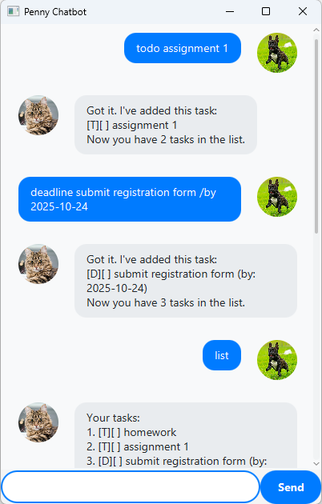

# Penny User Guide
___



Penny is a simple, lightweight task management chatbot written in Java.
You interact with Penny using text-based commands to manage your tasks.
Tasks are automatically saved in `data/task_storage.csv` and reloaded the next time you run Penny.

## Adding Todos
___

Todos are tasks without a specific date or time.

The Command should be written in the format: `todo TASK_DESCRIPTION`

Example: `todo Read book`

The expected output on successful addition of a todo task is:

```
Got it. I've added this task:
[T][ ] Read book
Now you have 1 task in the list.
```

## Adding Deadlines
___
Deadlines are tasks that need to be completed by a specific date.

The Command should be written in the format: `deadline TASK_DESCRIPTION /by DUE_DATE`

Example: `deadline Submit report /by 2025-11-30`

The expected output on successful addition of a deadline task is:

```
Got it. I've added this task:
[D][ ] Submit report (by: 2025-11-30)
Now you have 2 tasks in the list.
```

## Adding Events
___

Events are tasks that occur from a specific date to another date.

The Command should be written in the format: `event TASK_DESCRIPTION /from START_DATE /to END_DATE`

Example: `event Orientation camp /from 2025-07-20 /to 2025-07-24`

The expected output on successful addition of an event task is:

```
Got it. I've added this task:
[E][ ] Orientation camp (from: 2025-07-20 to: 2025-07-24)
Now you have 3 tasks in the list.
```

## Listing All Tasks
___
The Command should be written in the format: `list`

Example: `list`

The expected output is:

```
Here are the tasks in your list:
1.[T][ ] Read book
2.[D][ ] Submit report (by: 2025-11-30)
3.[E][ ] Orientation camp (from: 2025-07-20 to: 2025-07-24)
```

## Marking a Task as Done
___
The Command should be written in the format: `mark TASK_NUMBER`

Example: `mark 2`

The expected output is:

```
Nice! I've marked this task as done:
[D][X] Submit report (by: 2025-11-30)
```

## Unmarking a Task
___
The Command should be written in the format: `unmark TASK_NUMBER`

Example: `unmark 2`

The expected output is:

```
OK, I've marked this task as not done yet:
[D][ ] Submit report (by: 2025-11-30)
```

## Deleting a Task
___
The Command should be written in the format: `delete TASK_NUMBER`

Example: `delete 1`

The expected output is:

```
Noted. I've removed this task:
[T][ ] Read book
Now you have 2 tasks in the list.
```

## Finding Tasks
___
The Command should be written in the format: `find KEYWORD`

Example: `find report`

The expected output is:

```
Here are the matching tasks in your list:
1.[D][ ] Submit report (by: 2025-11-30)
```

## Adding a Note to a Task
___
The Command should be written in the format: `note TASK_NUMBER /content NOTE_CONTENT`

Example: `note 2 /content Remember to include financial analysis`

The expected output is:

```
Got it! I've added your note to the task:
[D][ ] Submit report (by: 2025-11-30) {note: Remember to include financial analysis}
```

## Exiting Penny
___
The Command should be written in the format: `bye`

Example: `bye`

The expected output is:

```
Bye. Hope to see you again soon!
```
